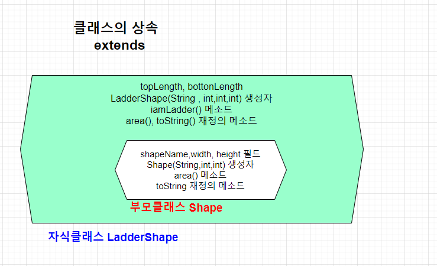

## 수업 내용 요약

### day12 (5.8)

#### MySimpleMath.java
+ 자바의 Math 클래스 메소드를 간단히 구현해보기
                + static 메소드 또는 static 필드 : 클래스 이름으로 사용한다.
+ 실행에 필요한 main 메소드를 제외하며 이 클래스를 라이브러리 클래스로 만들어 봅니다.
+ 메소드 오버로딩(overloading) : 메소드 시그니처서에서 메소드 이름은 같고 인자(매개변수)의 형식과 개수가 다른
형식이 여러개 만들어질 수 있습니다. 이것이 메소드 오버로딩 입니다.

#### MyIntegerValue.java
+ 데이터를 저장하고 그 데이터에 처리 기능을 갖는 메소드로 구성되는 클래스
+ __인스턴스 필드__  와  __인스턴스 메소드__  로 구성 (static 아님)
+ 인스턴스는 새로운 객체를 생성(new 연산)해서 데이터를 저장하고 실행. 객체 생성자 : new
+ 접근 한정자 테스트 : public, default(package), private

#### Member.java
+ 웹에서 회원가입할 때 사용하는 회원 정보를 예시로 클래스를 정의
+ private 필드에 대한 접근 메소드 : gerrer(읽기), setter(쓰기)
		+ getter : 현재 필드값을 리턴하는 형식이 필요     
		+ setter : 인자값을 받을 매개 변수 선언 필요
	
### Score : 연습 문제

### day13 (5.9)

#### Product.java
+ 생성자는 클래스이름과 동일하며 리턴타입이 없는 메소드.
+ 기본생성자만 사용할때는 생략하고 명시적으로 정의하지 않음.
+ 생성자는 오버로딩이 가능한 메소드.

#### Score.java
+ day12의 Score 클래스는 기본생성자로 동작함.
+ day13의 Score 클래스는 매개변수 4개를 받아 초기화하는 생성자만 동작함.
	+ 기본 생성자의 명시적 정의가 없으므로 디본 생성자 사용 못함.
	
#### B08StringConstuctor.java
+ 자바 라이브러리의 String 클래스 생성자들 테스트 하기.
	

### day14 (5.10)

#### B11ScoreArray.java
+ 5.9 과제 : Score 객체 배열에 (*객체 참조값*)저장하는 연습
+ Score[] students = new Score[7];
	+ students 배열에 저장되는 참조값은 Score 객체를 참조하는 값이다. 다른 객체를 참조할 수 없습니다. 예를 들면 User 객체는 참조할 수 없는 배열입니다.
		+ *이 명령은 Score 객체 7개를 참조할 수 있는 배열을 선언합니다.*

#### B12ClassAFamily.java
+ ClassA.java 의 자식클래스를 생성해서 테스트
	+ 자식 클래스 partB.day.ClassAA.java 는 protected 테스트
		+ 자식 클래스 partB.day14.test.ClassAB.java 는 protected 테스트
+ partB.day.test.B12ClassAFamily.java 는	접근 한정자 public,private,default,protected 테스트
	+ 1. 자식 클래스는 부모 클래스의 필드와 메소드를 사용할 수 있음.(단, private 은 상속 안됨)
		+ 2. 자식클래스 생성자는 부모클래스 생성자를 먼저 호출(실행)합니다. 부모 클래스의 객체가 먼저 만들어지고, 자식 필드와 메소드가 추가되어 확장되는 객체가 생성(자식 생성자 실행)
		+ 3. protected 로 정의된 필드 또는 메소드는 __다른 패키지에서 사용될 때__ , 자식 클래스가 아니면 사용할 수 없습니다. (즉, 자식 클래스에게만 상속시킵니다.)
	
#### B13ShapeTest.java
+ 상속 예시
	+ Shape 부모 클래스
		+ Triangle, Circle, LadderShape 자식 클래스
	
+ 상속의 특징
	+ 자식 객체 생성할 때, 부모 생성자 실행 후 자식 생성자 실행. -부모 생성자에서 사용 가능한 것을 호츌하지 않으면 오류   
		+ 자식 클래스는 부모의 메소드를 재정의(overriding) 할 수 있다. @Override 로 표시.(@는 에노테이션)
	

### day15 (5.11)

#### B14ShapeV2Test.java

+ 형변환(Casting)
	+ 기본 자료형 변환 : int , double, char,.... .자동형변환 / 강제형변환(명시적형변환)
		+ 클래스 타입의 자료형 변환 : 상속관계에서 부모와 자식클래스 사이의 형변환.
+ UpCasting : 부모 타입 변수에 자식 객체 대입하기 (자동 캐스팅)
+ DownCasting : 업캐스팅 했던 객체를 다시 자신(자식 클래스) 타입 변수로 참조 시킬때 
+ 다운 캐스팅 할때에는 instanceof 연산으로 타입체크를 꼭 하고, 결과가 참일때만 실행하도록 합니다. sh instanceof Circle 는 sh 참조객체는 new Circle(~~) 생성자로 생성된 것? sh instanceof Circle 결과가 참일 때만 Circle 로 다운캐스팅 합니다. 그렇지 않으면 오류.

#### AShape,java
+ 추상클래스로 선언. 추상 클래스는 직접 객체 생성 안함.
+ 추상메소드를 반드시 선언하는 클래스.
+ 추상메소든느 자식 클래스가 반드시 구현(implements). 모든 추상메소드 구현해야 합니다.
+ OCircle, OTriangle, OLadderShape 자식 클래스를 구현(AShape 클래스의 구현체)

#### B15AShapeTest.java
+ AShape 배열을 생성해서 구현체를 참고시키고, 업캐스팅/다운캐스팅 연습.

### 참고 1.: 상속의 효과(장점)
+ 반복된 코드 작성을 줄일 수 있습니다.(코드 재사용성 증가)
+ 유지 보수가 쉬워집니다.(클래스의 코드 변경이 공통된 필드/메소드에 대해 쉬워집니다.)
+ 객체 지향의 다형성 실현
	
	+ 다형성? polymorphism 의 사전적의미는 동질이상.
		+ 상속의 [메소드 재정의]로 구현할 수 있습니다. area() 메소드는 시그니처가 같고(동질) 실행내용 다름(이상). 
		+ 자식객체 참조를 [업캐스팅]해서 __부모 타입으로 참조해서 동일 집단__ 으로 그룹화 할 수 있기 떄문에 가능합니다.
		
### 참고 2.: final 키워드
+ 필드에 사용할 때 static final 은 상수, final 은 값 변경 못하는 인스턴스 필드
+ 메소드에 사용할 때는 자식 클래스가 재정의 할 수 없는 메소드.
+ 클래스에 사용할 때는 상속 할 수 없는 클래스.
 public final Animal{ } 클래스라면 자식 클래스가 만들어질 수 없다.
 
### 참고 3.: object 클래스
+ 모든 클래스들(자바 라이브러리 클래스와 개발자가 만들 클래스)의 부모 클래스.
+ 상속은 n차 상속이 가능합니다. n차 상속에서 가장 꼭대기에 있는 클래스 object 클래스
+ object 클래스의 메소드는 모든 객체가 상속 받습니다.
 toString() 재정의를 했던 것은 object 의 메소드 입니다.
 
 

 
#### Animal.java
+ 필드 타입과 인스턴스 메소드 인자가 Object 클래스인 예시
+ 인스턴스 메소드 iamAnimal 은 Object 인자의 타입을 검사하여
 그에 맞는 다운캐스팅과 메소드 실행을 합니다.
 
#### B16ObjectTypeTest.java
+ Animal 클래스인 iamAnimal 메소드 테스트
 
#### solution 패키지
+ Product 추상클래스를 이용한 복습 문제
 